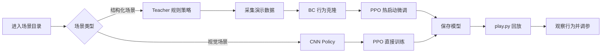
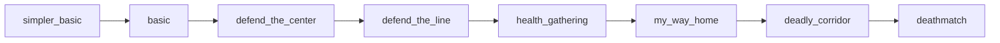

<p align="center">
  
</p>

<h1 align="center">ViZDoom Scenarios Project</h1>

<p align="center">
  <strong>从一个场景开始，训练、回放、观察，再一步步做出自己的 Doom AI。</strong>
</p>

<p align="center">
  <a href="https://github.com/Farama-Foundation/ViZDoom"></a>
  <a href="https://vizdoom.farama.org/"></a>
  
  
  
</p>

一个面向初学者的 ViZDoom 教学项目。项目把 ViZDoom 自带场景拆成独立目录，让你可以先进入某个场景，直接训练、回放、观察行为，再逐步理解背后的强化学习和模仿学习代码。

核心入口是 `scenarios/`。日常使用时，你通常只需要进入某个场景目录，运行 `train.py` 和 `play.py`。

| 你能做什么 | 对应入口 |
| --- | --- |
| 快速跑通一个 Doom AI baseline | `scenarios/basic/train.py` |
| 回放 PPO、BC、Teacher 行为 | `scenarios/<scene>/play.py` |
| 采集教师演示并做行为克隆 | `scenario_collect.py` + `scenario_bc.py` |
| 从 BC 热启动 PPO 训练 | `scenario_pipeline.py` |
| 在远程环境无窗口评估 | `--headless --episodes <N>` |

> 顶部动图来自 Farama Foundation 的 ViZDoom 官方仓库，用于展示 ViZDoom gameplay 效果。

## 项目亮点

| 亮点 | 说明 |
| --- | --- |
| 场景拆分 | 每个 ViZDoom 场景都有独立目录，入口清楚，不需要先读完整框架 |
| 教学路线 | 从 `simpler_basic` 到 `deathmatch`，按难度逐步推进 |
| 两段式训练 | 简单场景先用 Teacher + BC 热启动，再交给 PPO 微调 |
| 视觉任务 | 复杂场景直接使用视觉 PPO，保留 Doom 原始画面的学习挑战 |
| 远程友好 | 支持 `--headless`，可以在服务器上只看回放分数和动作日志 |
| 可调试 | 奖励、教师策略、训练入口都拆开，方便逐段修改 |

## 快速开始

已有虚拟环境时：

```bash
cd /home/laoshansong/vizdoom_project
source venv/bin/activate
cd scenarios/basic
python train.py
python play.py --agent ppo
```

第一次配置环境时：

```bash
cd /home/laoshansong/vizdoom_project
python3 -m venv venv
source venv/bin/activate
pip install -r requirements.txt
```

## 视觉预览

| 内容 | 说明 |
| --- | --- |
| 官方 gameplay 动图 | 顶部展示的是 ViZDoom 官方 demo GIF，适合快速理解“从画面输入到动作输出”的体验 |
| 官方资源 | [ViZDoom GitHub](https://github.com/Farama-Foundation/ViZDoom) 和 [ViZDoom Docs](https://vizdoom.farama.org/) 提供更多截图、文档和示例 |
| 本项目回放 | 训练后执行 `python play.py --agent ppo`，可以直接看到你的模型行为 |
| 无窗口评估 | 执行 `--headless --episodes 10`，适合远程机器只看分数和动作日志 |

```bash
cd /home/laoshansong/vizdoom_project/scenarios/basic
python play.py --agent ppo
python ../../scenario_pipeline.py --scenario basic --stage play --headless --episodes 10
```

## 训练总览



## 命令速查

| 目标 | 命令 |
| --- | --- |
| 训练当前场景 | `python train.py` |
| 回放 PPO | `python play.py --agent ppo` |
| 回放 Teacher | `python play.py --agent teacher` |
| 回放 BC | `python play.py --agent bc` |
| 增加训练步数 | `python train.py --timesteps 500000` |
| 无窗口回放 | `python ../../scenario_pipeline.py --scenario basic --stage play --headless --episodes 10` |
| 从 checkpoint 继续 | `python ../../scenario_pipeline.py --scenario basic --stage train --resume <checkpoint.zip>` |
| 调整 BC 早停 | `python ../../scenario_pipeline.py --scenario basic --val-split 0.1 --patience 3` |

## 目录导航

- [项目结构](#项目结构)
- [视觉预览](#视觉预览)
- [训练总览](#训练总览)
- [命令速查](#命令速查)
- [推荐学习路线](#推荐学习路线)
- [两条训练路线](#两条训练路线)
- [常用命令](#常用命令)
- [核心算法](#核心算法)
- [调试指南](#调试指南)
- [用 AI 辅助开发](#用-ai-辅助开发)
- [设计原则](#设计原则)

## 项目结构

```text
/home/laoshansong/vizdoom_project
├── scenarios/               # 每个场景的入口目录
│   ├── basic/
│   │   ├── train.py          # 训练入口
│   │   ├── play.py           # 回放入口
│   │   ├── model_path.txt    # 默认模型路径说明
│   │   └── README.md         # 场景说明
│   └── ...
├── artifacts/scenarios/     # 训练生成的模型、日志、演示数据
├── scenario_env.py          # ViZDoom Gym 环境封装
├── scenario_teacher.py      # 规则教师策略
├── scenario_collect.py      # 教师演示采集
├── scenario_bc.py           # Behavior Cloning 训练
├── scenario_train.py        # PPO 训练
├── scenario_play.py         # 模型回放
├── scenario_pipeline.py     # 串联完整流程
├── scenario_catalog.py      # 场景元数据
└── scenario_model.py        # BC 模型定义
```

推荐先读根目录 README，再看 [scenarios/README.md](./scenarios/README.md)，最后进入具体场景目录。

## 推荐学习路线

| 顺序 | 场景 | 目标 |
| --- | --- | --- |
| 1 | `simpler_basic` | 学会最小动作空间下的目标修正 |
| 2 | `basic` | 学会左右移动、对准、开火 |
| 3 | `defend_the_center` | 学会搜索、转向、防守 |
| 4 | `defend_the_line` | 在更稳定的正面防守中减少乱晃 |
| 5 | `health_gathering` | 学会朝资源移动并维持生存 |
| 6 | `my_way_home` | 开始视觉导航和连续探索 |
| 7 | `deadly_corridor` | 进入移动、战斗、生存混合任务 |
| 8 | `deathmatch` | 尝试复杂战斗 baseline |

一句话：先学瞄准和开火，再学搜索和防守，再学生存和找路，最后再碰复杂战斗。



### 场景矩阵

| 场景 | 难度 | 输入 | 主路线 | 适合练习 |
| --- | --- | --- | --- | --- |
| `simpler_basic` | 入门 | 结构化状态 | Teacher -> BC -> PPO | 最小射击闭环 |
| `basic` | 入门 | 结构化状态 | Teacher -> BC -> PPO | 对准、左右修正、开火 |
| `defend_the_center` | 入门 | 结构化状态 | Teacher -> BC -> PPO | 搜索、转向、防守 |
| `defend_the_line` | 中级 | 结构化状态 | Teacher -> BC -> PPO | 稳定正面防守 |
| `health_gathering` | 中级 | 结构化状态 | Teacher -> BC -> PPO | 找资源、生存 |
| `my_way_home` | 中级 | 视觉帧 | PPO | 探索和导航 |
| `deadly_corridor` | 高级 | 视觉帧 | PPO | 移动、战斗、生存 |
| `deathmatch` | 专家 | 视觉帧 | PPO | 复杂战斗 baseline |

### 通关观察标准

| 场景 | 观察重点 |
| --- | --- |
| `simpler_basic` | 不再随机乱动，开始朝目标修正 |
| `basic` | 能左右修正，并在对准后开火 |
| `defend_the_center` | 会搜索、转向，并在中心区域稳定攻击 |
| `defend_the_line` | 比 `defend_the_center` 更稳，不容易乱晃 |
| `health_gathering` | 会朝资源移动，而不是在危险中原地耗死 |
| `my_way_home` | 不再只是撞墙和打转，出现连续探索路径 |
| `deadly_corridor` | 行为有连续战斗和移动意图 |
| `deathmatch` | 至少形成可持续行动，而不是彻底随机 |

## 两条训练路线

> 训练路线分成两类：能写规则的场景先让模型模仿老师，复杂视觉场景直接让 PPO 从画面中学习。

### 结构化场景

适合：`simpler_basic`、`basic`、`defend_the_center`、`defend_the_line`、`health_gathering`、`take_cover`

特点：

- 动作空间较小
- 目标清楚
- 可以写规则教师策略
- 适合先模仿，再强化学习

流程：

```text
Teacher Policy -> Demo Collection -> BC -> PPO
```

```text
看到结构化状态
   |
   v
规则教师选择动作
   |
   v
采集演示数据
   |
   v
BC 学会老师动作
   |
   v
PPO 继续自己练
```

### 视觉 PPO 场景

适合：`my_way_home`、`deadly_corridor`、`cig`、`deathmatch`、`doom`

特点：

- 目标难以靠规则完整描述
- 动作和场景更复杂
- 更依赖视觉输入和时序学习

流程：

```text
Visual Observation -> PPO
```

```text
游戏画面
   |
   v
CNN Policy
   |
   v
PPO 与环境交互
   |
   v
保存可回放模型
```

## 常用命令

### 训练和回放

```bash
cd /home/laoshansong/vizdoom_project/scenarios/basic
python train.py
python play.py --agent ppo
```

结构化场景也可以回放教师或 BC 模型：

```bash
python play.py --agent teacher
python play.py --agent bc
python play.py --agent ppo
```

### 调整训练步数

```bash
python train.py --timesteps 500000
```

如果不传 `--timesteps`，项目会按场景难度使用默认训练步数。

### 完整流程参数

```bash
python ../../scenario_pipeline.py --scenario basic --val-split 0.1 --patience 3
```

`--val-split` 和 `--patience` 会传给 BC 训练，用于验证集划分和早停。

### 断点继续训练

```bash
python ../../scenario_pipeline.py \
  --scenario basic \
  --stage train \
  --resume ../../artifacts/scenarios/basic/checkpoints/basic_ppo_50000_steps.zip
```

### 无窗口回放评估

```bash
python ../../scenario_pipeline.py --scenario basic --stage play --headless --episodes 10
```

`--headless` 适合远程机器、无桌面环境或只想看 episode 分数时使用。

## 第一次真正上手

建议先跑 `basic`：

```bash
cd /home/laoshansong/vizdoom_project/scenarios/basic
python train.py
```

这一步通常会触发：

```text
Teacher -> Demo Collection -> BC -> PPO
```

训练完成后：

```bash
python play.py --agent ppo
```

第一次看回放时，不要只盯分数。更重要的是观察行为：

- 是否会朝目标方向修正
- 是否会在正确时机开火
- 是否比随机动作更像有意图地行动

如果是导航场景，重点看：

- 是否一直撞墙
- 是否持续朝某个方向探索
- 是否比随机走路更像在找路

## 核心算法

### Q-Learning

核心问题是：在状态 `s` 下，动作 `a` 值不值得做。它学习的是 `Q(s, a)`，也就是某动作的长期价值。

### DQN

可以理解为：

```text
Q-Learning + Neural Network
```

DQN 是经典入门方法，但在复杂 Doom 纯视觉任务里通常偏慢、偏难调。

### BC

`Behavior Cloning`，行为克隆。本质是监督学习：

- 输入状态
- 标签是教师动作
- 输出预测动作

在这个项目里，BC 的主要价值是给 PPO 做热启动。

### PPO

`Proximal Policy Optimization` 是本项目主训练算法。直观理解：

```text
每次更新策略时，不要改得太猛，稳定一点，慢慢变好。
```

### 教师策略

教师策略不是神经网络，而是手写规则。例如在 `basic` 里：

```text
目标在左边 -> 向左移动
目标在右边 -> 向右移动
基本对准 -> 开火
```

教师运行时留下 `(状态, 动作)` 数据，后续用于 BC 训练。

## 为什么不把 DQN 作为主线

项目目标不是方法纯度，而是尽快让新手做出一个真的会行动的 Doom 模型。

纯视觉 DQN 常见问题：

- 学得慢
- 难调参
- 难 debug
- 新手长时间看不到正反馈

所以这里采用：

- 简单场景先走结构化路线
- 复杂场景再走视觉 PPO

## 调试指南

### 原地转圈或一直撞墙

可能原因：

- 探索不够
- 陷入局部最优
- 某个无意义动作暂时没有被惩罚

排查方向：适当调大探索强度，例如 `ent_coef`。

### 对着空气疯狂开火

可能原因：奖励函数被模型钻了空子。

排查方向：

- 检查是否奖励了“开火”，却没有惩罚“乱开火”
- 增加“开火但未命中”的惩罚

### BC 回放很好，一进 PPO 就崩

可能原因：

- PPO 学习率过大
- 更新太猛，忘掉了教师动作

排查方向：

- 把学习率从 `3e-4` 降到 `1e-4`
- 缩短 PPO 总训练步数，观察是否后期崩盘

### reward 在涨，但回放还是很差

可能原因：reward 奖励的不是你真正想要的行为，而是某个容易被钻空子的近似指标。

推荐排查顺序：

```text
先看回放行为
   ->
再查奖励是不是在奖励错误动作
   ->
再查探索强度够不够
   ->
再查学习率是不是太大
   ->
最后才考虑要不要换算法
```

一句话原则：先怀疑奖励设计和调参，再怀疑算法本身。

## 用 AI 辅助开发

在这个项目里，最适合让 AI 帮你的不是“重写整个 RL 项目”，而是局部任务：

- 写 Teacher 策略
- 设计 Reward Shaping
- 解释 traceback
- 分析回放行为
- 给某个场景提出参数调整建议

### 写 Teacher 策略

示例 Prompt：

```text
我正在用 ViZDoom 做 health_gathering 场景。
游戏状态包含玩家血量和周围物品的相对坐标。
请帮我写一段 Python 规则代码，逻辑是：
优先向距离最近的急救包移动，如果血量低于 20 则全速前进。
只输出动作选择逻辑即可。
```

### 设计 Reward Shaping

示例 Prompt：

```text
我的 PPO 模型在 my_way_home 场景里总是原地转圈。
目前奖励只有找到终点给 +100，其余是 0。
请帮我设计一个密集奖励函数，比如根据距离终点远近给小奖励，
并提供具体的数学映射逻辑。
```

### 解释报错

把完整 traceback 和你刚改的几行代码一起发给 AI，并要求它优先判断：

- 路径问题
- shape 问题
- 依赖问题
- 逻辑问题

### 推荐 Prompt 模板

```text
我在做 ViZDoom 的 <场景名> 场景。
当前文件是 <train.py / play.py / 教师规则文件 / 奖励函数位置>。
输入状态有：<列出状态变量>。
动作空间有：<列出动作>。
当前问题是：<原地打转 / 撞墙 / 乱开火 / 奖励不涨 / shape 报错>。

请你只帮我修改：<教师动作逻辑 / reward shaping / 报错定位 / 参数建议>。
不要重写整个项目，只给出可以直接粘贴的 Python 逻辑和修改原因。
```

## 设计原则

- 每个场景一个文件夹
- 每个场景文件夹只暴露最少入口
- 初学者不需要先理解公共脚本再开始训练
- 结构化场景走 `teacher -> demos -> BC -> PPO`
- 更复杂或无标签场景直接走视觉 `PPO`
- 先跑通一个简单场景，再升级到复杂场景

## 常见误区

- 不要一上来就练 `deathmatch`
- 不要一上来就要求像人一样打 Doom
- 不要模型一蠢就立刻换算法
- 不要只看 reward，不看回放行为

## 最后只记这一句

```bash
cd /home/laoshansong/vizdoom_project/scenarios/basic
python train.py
python play.py --agent ppo
```

先从 `basic` 开始，不要跳级。
